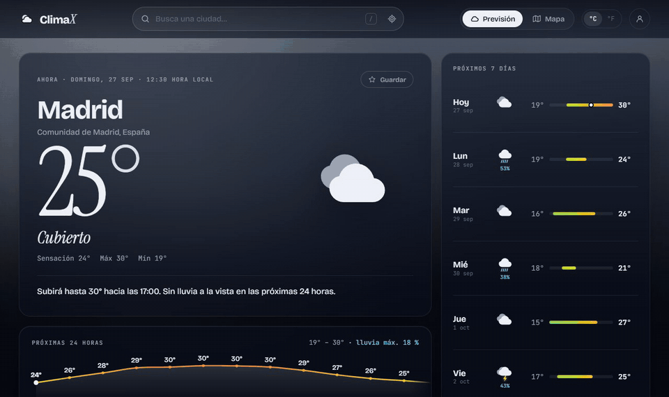
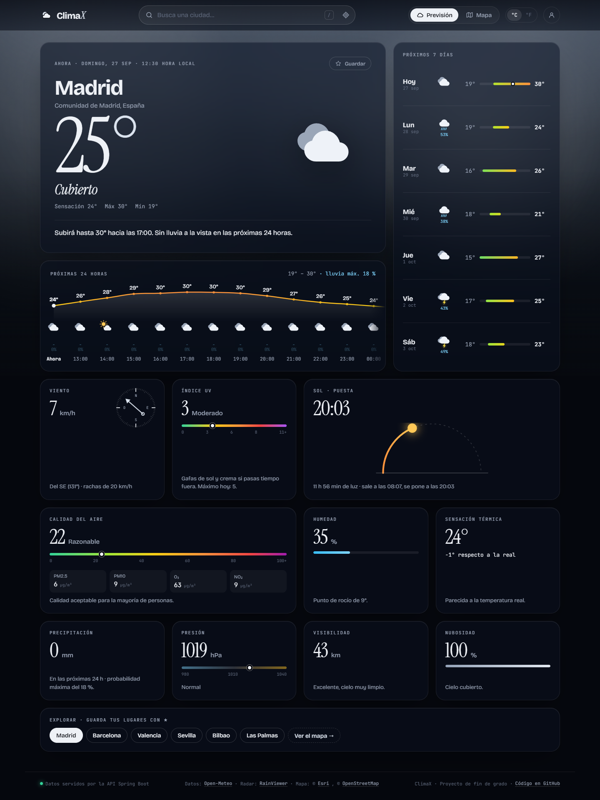
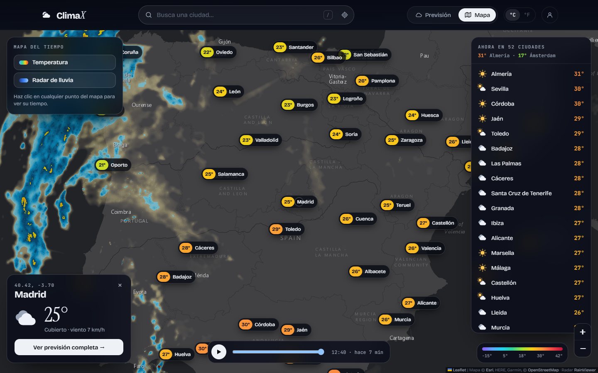
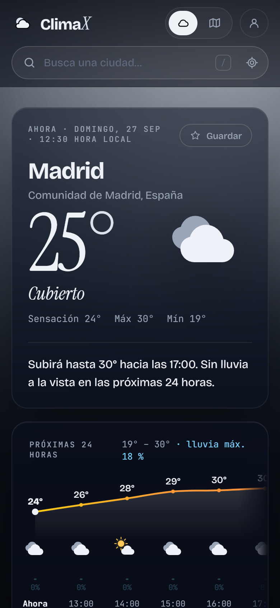
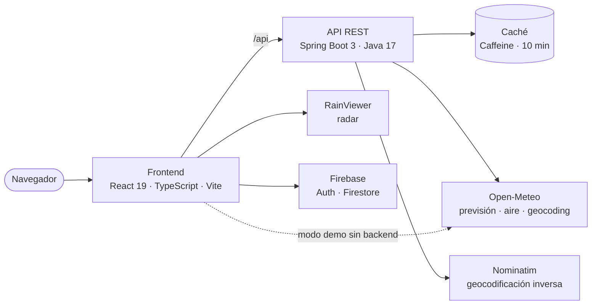

<div align="center">

# ClimaX

**El tiempo, con detalle.** Aplicación meteorológica full-stack con **React + TypeScript** y **Spring Boot**:
previsión por horas y días, calidad del aire, índice UV y un mapa con radar de lluvia en directo.

[](https://github.com/abelg02/ClimaX-TFG/actions/workflows/ci.yml)
[](https://abelg02.github.io/ClimaX-TFG/)


### [▶ Probar la demo](https://abelg02.github.io/ClimaX-TFG/)



</div>

---

## Qué hace

- **Previsión completa** de cualquier lugar del mundo: tiempo actual, curva de temperatura de las próximas 24 horas y los próximos 7 días con barras de rango.
- **Cielo animado** que cambia según el tiempo real: lluvia, nieve, tormenta con relámpagos, estrellas de noche o el brillo del sol.
- **Indicadores detallados**: viento con brújula, índice UV, calidad del aire europea (PM2.5, PM10, O₃, NO₂), recorrido del sol, humedad, presión, visibilidad y nubosidad.
- **Avisos automáticos** de calor, heladas, viento fuerte, tormentas o lluvia intensa.
- **Mapa interactivo** con temperaturas de más de 50 ciudades, **radar de lluvia animado** y consulta del tiempo en cualquier punto al hacer clic.
- **Búsqueda con autocompletado**, geolocalización, grados °C/°F y enlaces que se pueden compartir (cada previsión tiene su propia URL).
- **Cuenta opcional** (Firebase Auth) para sincronizar tus lugares guardados entre dispositivos.
- Diseño **responsive** y accesible: navegación con teclado, roles ARIA y respeto de `prefers-reduced-motion`.

| Previsión | Mapa | Móvil |
| --- | --- | --- |
|  |  |  |

## Arquitectura



- El **backend** agrega la previsión y la calidad del aire (en paralelo), normaliza la respuesta en un contrato propio (`record`s de Java), traduce los códigos WMO al español, cachea con Caffeine y devuelve los errores en formato estándar RFC 9457.
- El **frontend** consume ese contrato. Si el backend no está disponible (como en la demo de GitHub Pages), cambia automáticamente a consultar Open-Meteo desde el navegador con el mismo contrato, así que la demo funciona sin servidor.

### API

| Método | Ruta | Descripción |
| --- | --- | --- |
| `GET` | `/api/weather?lat=40.41&lon=-3.70` | Tiempo actual, 24 h, 7 días y calidad del aire |
| `GET` | `/api/places?q=valencia` | Búsqueda de lugares |
| `GET` | `/api/places/reverse?lat=..&lon=..` | Nombre del lugar a partir de coordenadas |
| `GET` | `/api/map/cities` | Temperatura actual de las ciudades del mapa (una sola petición) |
| `GET` | `/actuator/health` | Estado del servicio |

## Ejecutarlo en local

Requisitos: **Java 17+** y **Node.js 20+**. No hace falta base de datos ni ninguna API key.

```bash
# 1. Backend (http://localhost:8080)
./mvnw spring-boot:run          # En Windows: mvnw.cmd spring-boot:run

# 2. Frontend (http://localhost:5173), en otra terminal
cd frontend
npm install
npm run dev
```

El servidor de desarrollo de Vite redirige `/api` al backend. Si solo arrancas el frontend, la app funciona igualmente en modo demo.

### Tests y calidad

```bash
./mvnw test                     # Tests del backend: mapeo con respuestas reales, validación, CORS, errores
cd frontend && npm run lint && npm run build
```

GitHub Actions ejecuta ambos en cada push y publica la demo en GitHub Pages.

## Estructura

```
├── src/main/java/com/example/climaxtfg
│   ├── client/        Cliente HTTP de Open-Meteo y Nominatim
│   ├── config/        RestClient, seguridad, CORS y propiedades
│   ├── controller/    Endpoints REST
│   ├── exception/     Errores en formato problem+json
│   ├── model/         Contrato de la API (records) y códigos WMO
│   └── services/      Previsión, lugares, mapa y mapeo de respuestas
├── frontend/src
│   ├── components/    Cabecera, buscador, iconos SVG, cielo animado, paneles del tiempo
│   ├── pages/         Previsión, mapa, cuenta y pantalla de error
│   ├── services/      Capa de datos (API + modo directo) y Firebase
│   ├── hooks/         useForecast con caché en memoria
│   └── utils/         Formato, escala de colores de temperatura, URLs
└── docs/              Capturas y GIF de demostración
```

## Historia del proyecto

ClimaX nació como mi **proyecto de fin de grado superior**. La versión 2.0 es un rediseño completo:

- **Interfaz nueva**: sistema visual propio, iconos SVG animados, cielo dinámico y mapa oscuro con radar.
- **Backend reescrito**: ya no necesita PostgreSQL ni una API key de pago, tiene caché, validación, errores tipados y tests.
- **Seguridad**: la API key que estaba en el código se ha eliminado y el CORS queda limitado a los orígenes configurados.
- **Demo pública** desplegada automáticamente con GitHub Actions.

## Créditos

Datos meteorológicos de [Open-Meteo](https://open-meteo.com/) (CC BY 4.0) · Radar de [RainViewer](https://www.rainviewer.com/) · Mapa © [Esri](https://www.esri.com/) y © [OpenStreetMap](https://www.openstreetmap.org/copyright) · Geocodificación de [Nominatim](https://nominatim.org/).

---

Hecho por [Abel G.](https://github.com/abelg02)
